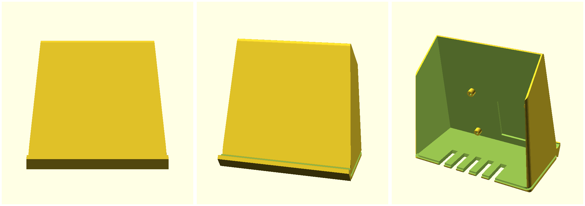

# Stand

A slanted face that holds the card like a record on a shelf, with the Pi
mounted directly behind it and **the back left open**.



Rendered above: front, three-quarter, and the open back.

The open back is the whole idea. The Pi's ports face into it, so cables plug
straight into the board — no panel cutouts to get wrong, no internal extension
cables, and the airflow comes free. From the front you see a sleeve on a
stand; everything else is behind it.

The 15° lean means gravity holds the card against the face. The current box
has it vertical, so a strip of felt is doing all the work.

## Print the coupon first

**`face_t` is the one dimension that can quietly ruin this.** Too thick and
the reader stops seeing 4-byte cards — and it fails as intermittent flapping,
not as an honest "no read", which is much harder to diagnose once it's
assembled.

```sh
openscad -o coupon.stl -D 'part="coupon"' stand.scad
```

Six pads, 1.0–4.0 mm. Print it, then run `spikes/presence_check.py` with your
**worst** card (a 4-byte Mifare-style one — 78 of the 132 are that type) held
against each pad. Watch the **presence cycle count**, not whether it reads at
all: a marginal thickness reads fine held still and falls apart when a card is
set down.

Set `window_t` to the largest thickness that stays rock solid, then print the
stand.

## Then the stand

```sh
openscad -o stand.stl stand.scad
```

Defaults give a 112 × 110 mm face, 62 mm deep, for a 95 mm card. Everything is
parametric — card size, lean, lip, panel thickness, Pi hole spacing, antenna
window — at the top of `stand.scad`.

**Measure the tag, not the HAT.** The HAT is already in the file: Waveshare's
own dimension drawing gives an 85 x 56 mm board — the same footprint as the Pi,
not a short 65 mm HAT — with a 37.4 x 37.8 mm coil panel centred 17.0 mm along
the long axis and 2.3 mm across from the board centre, on the far side from the
GPIO header.

So the only thing to measure is where the tag sits on your cards. Set `tag_dx` /
`tag_dy` — its centre relative to the card's centre, seen from the **front**,
+x right and +y up. Stickers applied with the tag at the lower right *as seen
from the back* land at the lower left from the front, so both are negative.

The model then works out where the Pi has to go to put the coil on the tag, and
`hat_flipped` mirrors the offset by turning the HAT end-for-end — which is
usually what decides whether the coil can reach the tag at all. Three assertions
catch the ways this goes wrong: bosses in the side wall, bosses in the base, and
a coil window running off the edge of the card.

The panel is thinned **from behind**, so the outside stays flat and rigid
while the reader only has `window_t` of plastic to see through.

## Design notes

Every visible edge is chamfered and the vertical corners radiused, so the form
catches light along its arrises instead of showing a raw printed corner. A
**shadow reveal** runs round the base, which lifts the body optically and hides
the layer banding a first print always shows low down where the part is widest.
The top is **cut back** rather than coming to a point, and the sides **rake
inward** as they rise — the taper an arcade cabinet uses, and for the same
reason: straight sides read as a box, angled ones as a made object. The rake is
bounded by the card, which is square and cannot be encroached on.

The card **stands on a lip** and leans back against the face — gravity holds it,
which is the whole reason for the slant. The felt sits in a **recess** in the
lip's top so it finishes flush instead of proud, and the lip's underside is
chamfered back to the face: a ledge projecting from a panel that already leans
back is a full overhang, and would otherwise need support exactly where the
finish shows most. There is deliberately **no hole in the front**; a scallop cut
in the panel reads as damage rather than detail.

The **side walls carry back** to `back_h` of the front height, so the Pi and the
cavity aren't on show from the side. Lower looks lighter; too low and it's a
blade on a plinth.

`face_w` takes the **larger** of "wide enough for the card" and "wide enough for
the Pi wherever your tag offset puts it". That second case is not hypothetical —
a mounting boss that lands on the side wall merges into it, vanishes from the
render, and is only discovered when the Pi won't screw down.

## Printing notes

- **Orientation**: base down, as modelled. The face is 15° off vertical, which
  is well within overhang tolerance, and the lip is chamfered underneath so it
  needs no support.
- **No metal near the face.** Screws, heat-set inserts and magnets all kill NFC
  coupling. The standoffs take self-tapping M2.5 straight into plastic.
- **Keep the Pi's USB-C/HDMI corner clear** of anything dense — that's the Wi-Fi
  antenna, and it has little margin to spare.
- **Felt**: `felt_w` / `felt_t` cut a recess in the lip so the strip finishes
  flush instead of sitting proud.

## Rendering on Apple Silicon

The Homebrew and 2021.01 OpenSCAD builds are Intel-only. Either install
Rosetta (`softwareupdate --install-rosetta`) or fetch an arm64 development
snapshot from openscad.org.
